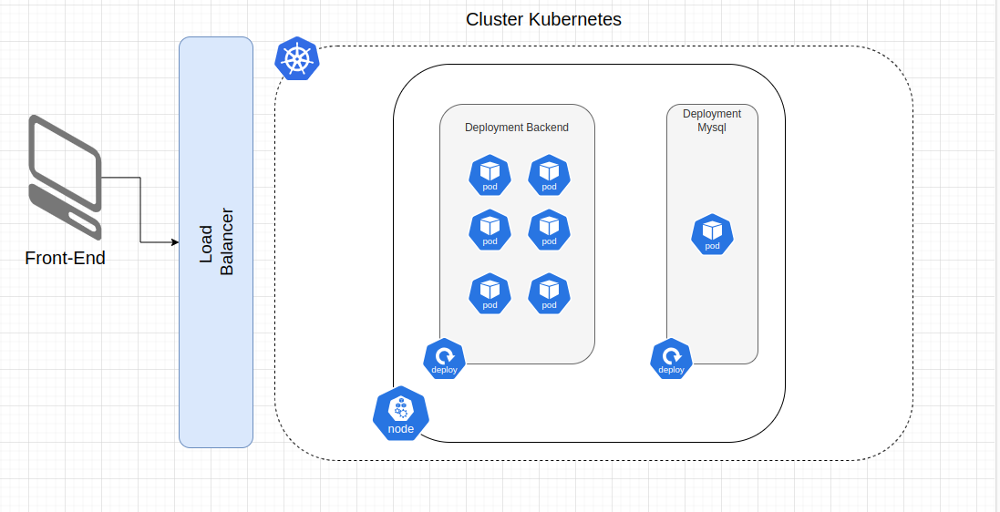

# Projeto de Estudo DIO - K8s 


## Intro

O objetivo desse projeto foi disponibilizar uma infra e conectar as aplicações de backend ( api + banco de dados) e um fronted explorando os serviços do kubernetes: deployments, services, loadbalancer e persistent volumes. Atingi esse objetivo criando a infraestrutura local com o `minikube`. 

## Execução do projeto

### Subindo a infraestrutura

Para executar as aplicações criei um script que executa todos os deployments e services de forma automática. Basta seguir os seguintes passos na raiz do projeto:

1. Dar permissão ao script:
```bash
    chmod +x ./create-all.sh
```

2. Executar o script*:
```bash
    ./create-all.sh
```
* Ao final do script, será alterado no arquivo frontend/js.js a url referente ao Loadbalancer no minikube
3. Abrir o arquivo index.html e usar a aplicação 

### Encerrando a infraestrutura

Para deletar/derrubar a infraestrutura também é necessário dar permissão ao script de deleção. Após dar o permissionamento é só executar o arquivo na raiz do projeto:

```bash
./delete-all.sh
```

### Arquitetura do Projeto

